# Crypt - Steganography CLI Tool

A CLI for steganography; focused on EAS, QRCode and DCT. Encryption and Decryption flows are supported.

Multiple methods fail to preserve the embedded information, after even a little compression. Here, a working "empirical" (opinionated?) workflow that survives heavy compression, is supported and proposed.

> Steganography hides presence; once the carrier is suspect, AES does the confidentiality.

*Threat model*: be **secretive**. Then, if found out, still be safe. Live through extreme compression.

## Example workflow:

``` mermaid
flowchart LR
    %% ── FIRST LINE (HIDE) ──────────────────────────────
    subgraph "HIDE (crypt encrypt … embed)"
        direction LR
        plaintext["Plain text"] --> cipher["AES‑256‑GCM"] --> b64["Base64"] --> qr["QR encode"] --> bits["Binary bits"] --> stego["Stego JPEG"]
    end

    %% ── SECOND LINE (REVEAL) ───────────────────────────
    subgraph "REVEAL (crypt decrypt)"
        direction LR
        extract["Extract DCT"] --> qr2["QR decode"] --> b642["Base64"] --> decrypt["AES‑256‑GCM decrypt"] --> plain2["Plain text"]
    end

    %% ── VERTICAL LINK BETWEEN THE ROWS ────────────────
    stego --> extract

    %% ── OPTIONAL STYLING FOR THE CARRIER JPEG ─────────
    classDef carrier fill:#ffd5b3,stroke:#e49a46,stroke-width:1.5px,color:#000;
    class stego carrier;
```



``` bash
crypt encrypt text q mysecurepassword qrcode binary embed "./test/input.jpeg" test/out_embedded.jpeg
```

``` bash
crypt decrypt image ./test/out_embedded.jpeg extract text mysecurepassword
```

See the embedded `sxiv ./test/out_embedded.jpeg`. The secret is there and no image distortions!

## Safezone

- Payload size ≈ 2 kB: QR Version 5‑L at 65 % `JPEG` quality is an empirical safezone. 
- E.g., will be there after linkedin compresses your image in a tiny `jpeg`, for example.
- No authenticity yet: GCM gives you integrity only if the key is secret. If you switch to a stronger KDF, you're fine; otherwise add an HMAC.

## Installation

### Prerequisites

This project uses CGO with libjpeg for JPEG processing. You'll need to install the libjpeg development library:

**Ubuntu/Debian:**
```bash
sudo apt-get install libjpeg-dev
```

**macOS:**
```bash
brew install jpeg
```

**Windows:**
```bash
# Install via MSYS2 or use WSL
pacman -S mingw-w64-x86_64-libjpeg-turbo
```

### Using go install (Recommended)

```bash
# Install the latest version
go install github.com/BuddhiLW/crypt/cmd/crypt@latest

# Or install a specific version
go install github.com/BuddhiLW/crypt/cmd/crypt@v1.0.0
```

### Building from source

```bash
# Clone the repository
git clone https://github.com/BuddhiLW/crypt.git
cd crypt

# Use the installation script (recommended)
./scripts/install.sh

# Or build manually
go build -o crypt cmd/crypt/main.go

# Or install locally
go install ./cmd/crypt
```

### Cross-platform builds

**Note:** Cross-compilation requires target-specific libjpeg libraries and may not work on all systems due to CGO dependencies.

```bash
# Build for all major platforms
make build-all

# Or build for specific platforms
make build-linux
make build-darwin
make build-windows
```

For reliable cross-platform builds, consider using Docker or building natively on each target platform.

### Creating Releases

```bash
# Create a new release
./scripts/release.sh v1.0.0

# Suggest next version
./scripts/release.sh --suggest

# Show current version
./scripts/release.sh --current
```

## Usage

```bash
# Get help
crypt help

# Encrypt data
crypt encrypt

# Decrypt data
crypt decrypt
```

## Supported Platforms

- Linux (amd64, arm64)
- macOS (amd64, arm64)
- Windows (amd64, arm64)

## Development

```bash
# Run tests
go test ./...

# Build and test locally
go build -o crypt cmd/crypt/main.go
./crypt help
```
