# Crypt 

A library for Steganography workflows. AES, QRCode, DCT embedding and extraction.

> Steganography hides presence; once the carrier is suspect, AES does the confidentiality.

*Threat model*: be **secretive**. Then, if found out, still be safe. Live through extreme compression.

## Example workflow:

``` mermaid
flowchart LR
    %% ── FIRST LINE (HIDE) ──────────────────────────────
    subgraph "HIDE (crypt encrypt … embed)"
        direction LR
        plaintext["Plain text"] --> cipher["AES‑256‑GCM"] --> b64["Base64"] --> qr["QR encode"] --> bits["Binary bits"] --> stego["Stego JPEG"]
    end

    %% ── SECOND LINE (REVEAL) ───────────────────────────
    subgraph "REVEAL (crypt decrypt)"
        direction LR
        extract["Extract DCT"] --> qr2["QR decode"] --> b642["Base64"] --> decrypt["AES‑256‑GCM decrypt"] --> plain2["Plain text"]
    end

    %% ── VERTICAL LINK BETWEEN THE ROWS ────────────────
    stego --> extract

    %% ── OPTIONAL STYLING FOR THE CARRIER JPEG ─────────
    classDef carrier fill:#ffd5b3,stroke:#e49a46,stroke-width:1.5px,color:#000;
    class stego carrier;
```



``` bash
crypt encrypt text q mysecurepassword qrcode binary embed "./test/input.jpeg" test/out_embedded.jpeg
```

``` bash
crypt decrypt image ./test/out_embedded.jpeg extract text mysecurepassword
```

See the embedded `sxiv ./test/out_embedded.jpeg`. The secret is there and no image distortions!

## Safezone

- Payload size ≈ 2 kB: QR Version 5‑L at 65 % `JPEG` quality is an empirical safezone. 
- E.g., will be there after linkedin compresses your image in a tiny `jpeg`, for example.
- No authenticity yet: GCM gives you integrity only if the key is secret. If you switch to a stronger KDF, you’re fine; otherwise add an HMAC.
